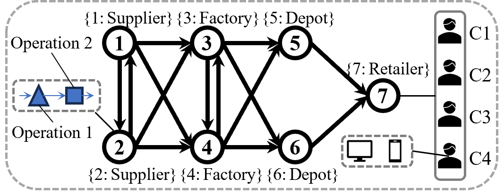

# Graph-Augmented-Lagrangian-Coordination(GraphALC)
## Introduction
GraphALC is a powerful method for coordinating decisions between nodes in a network. It is inspired by the Augmented-Lagrangian-Coordination (ALC) method and extends it further.

GraphALC focuses on the coordination and optimization of network nodes, where each node/unit has its own decision-making capability and can make decisions based on its own goals and constraints. The decisions between nodes need to be coordinated to achieve consistency or optimize the performance of the entire network.
1. Example 1: In a supply chain with asymmetric information and decentralized decisions, members need to coordinate their planning results to reach a unified supply plan. For example, the assembly company (decision node 0) has the decision-making power to select a supplier (decision node 1) to provide components, and conversely, the supplier has the decision-making power to choose the assembly company for supplying components. Because their goals and constraints differ, their decisions may conflict. Only when the decisions of both the assembly company and supplier are consistent can the supply chain plan be executed.  
2. Example 2: Within a manufacturing enterprise, there are production units (workshops) and logistics units (logistics departments). Typically, scheduling decisions for production nodes and route planning for logistics units are considered independently, meaning that their objectives and constraints differ. To achieve synchronized operation, the decisions of these two nodes need to be coordinated to enhance the overall performance of the manufacturing process.  
3. Example 3: A car consists of multiple structural units, such as the chassis, engine, interior, and tires. These components are typically designed and manufactured separately and then assembled together. Due to their independent design and production, structural inconsistencies or functional mismatches may occur between them. Therefore, during design and manufacturing, these units must be coordinated to enhance overall performance.

In the network, decision coordination among nodes can be categorized as follows:
1. Unidirectional Coordination: Node j passively receives node i's decision A, and node j makes no decision;
2. Bidirectional symmetric coordination: Node i and Node j repeatedly negotiate the same decision A;
3. Bidirectional Partially Symmetric Coordination: For node j, its decision consists of A and B. Node i passively receives node j's decision A, while decision B is determined through iterative coordination between the two nodes.
4. Bidirectional Asymmetric Coordination: Node i passively receives decision A from node j, while node j passively receives decision result B from node i, with A ∩ B = ∅.

The ALC method can only achieve "bidirectional symmetric coordination", while GraphALC can realize the four coordination types mentioned above.  
Furthermore, information sharing among nodes can lead to changes in each node's model and decisions. Based on this, this project further adds information sharing capabilities.

## Usage Instructions
1. This project runs on the Python environment and currently only supports Python 3.8. 
2. This project requires the following third-party libraries to be installed: numpy==1.24.3, gurobipy.

## Case Description
This project uses a supply network design problem with 7 enterprise nodes as an example. retailer 7 is responsible for fulfilling customer orders from the market, with each customer requiring two types of products. Finished products are transferred or stored in depots 5 and 6, and these finished products are manufactured by factories 3 and 4. Factories 3 and 4 need to produce these two types of products through two operations, with each product occupying different capacities of operation 1 and operation 2. Suppliers 1 and 2 are responsible for supplying components to factories 3 and 4, and these components also need to be produced through two operations, with different products' components occupying different capacities of operation 1 and operation 2. In Multi-Source Lateral and Vertical Procurement, suppliers 1 and 2, as well as factories 3 and 4, can mutually supply/share the capacity of two operations to meet demand. The goal of supply network design is to minimize transportation costs and maximize customer demand fulfillment.  

## Authors and Contributors
Hainan Huang, Email: hhn0113@outlook.com
